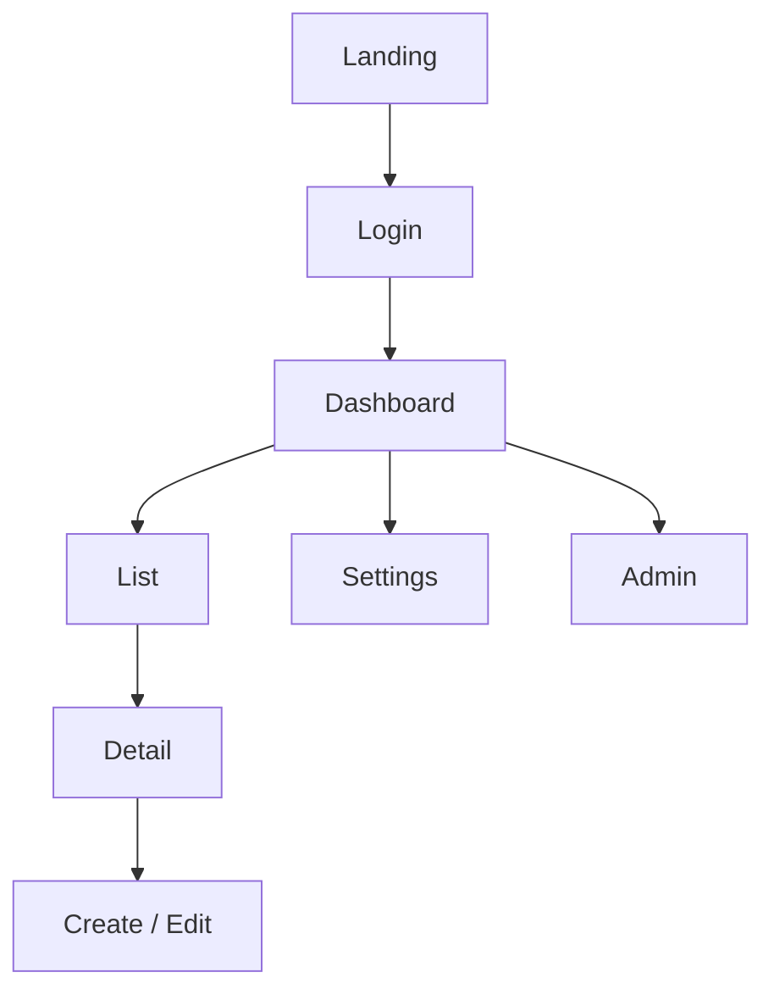
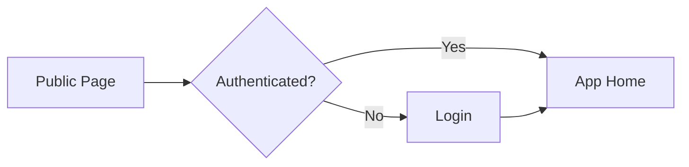
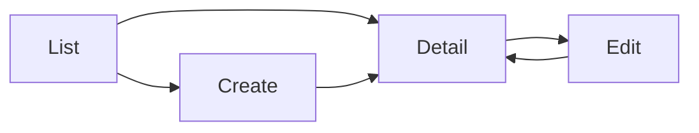
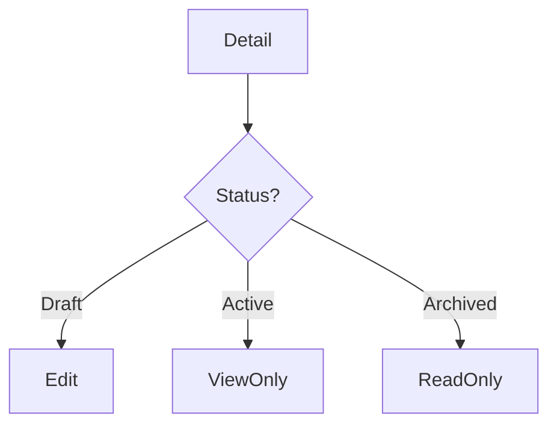
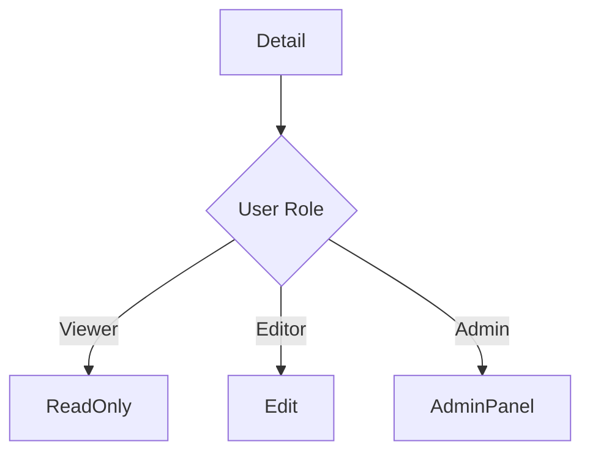
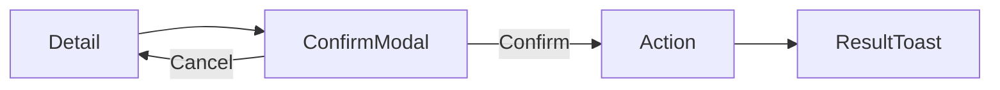
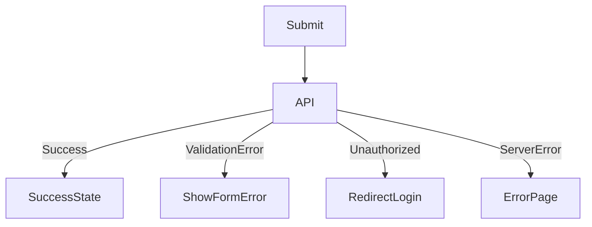
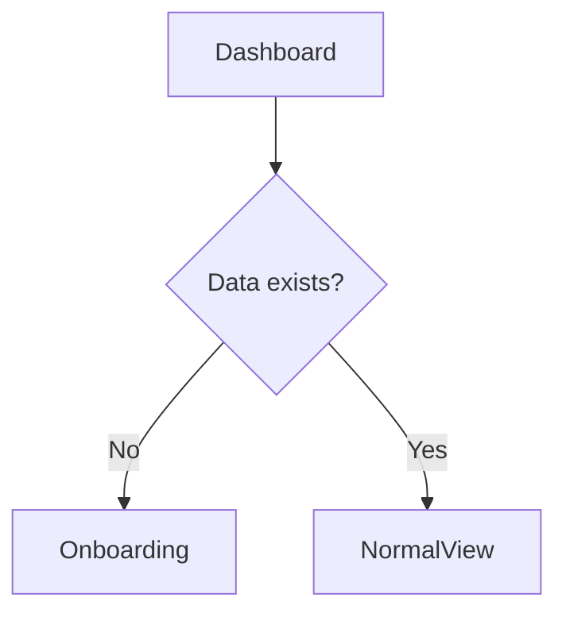

# 🖥️ screen-flow.md テンプレート

---

# 0️⃣ 設計前提

| 項目     | 内容                            |
| ------ | ----------------------------- |
| 対象ユーザー | 一般ユーザー / 管理者 / 未ログイン          |
| デバイス   | Desktop / Mobile / Responsive |
| 認証要否   | 公開ページあり / 全面認証制               |
| 権限制御   | RBAC / ABAC / なし              |
| MVP範囲  | P0画面のみ                        |

---

# 1️⃣ 画面一覧（Screen Inventory）

| ID   | 画面名     | 役割     | 認証  | 優先度 |
| ---- | ------- | ------ | --- | --- |
| S-01 | ランディング  | 入口     | 不要  | P0  |
| S-02 | ログイン    | 認証     | 不要  | P0  |
| S-03 | ダッシュボード | 中核画面   | 必須  | P0  |
| S-04 | 一覧画面    | リソース一覧 | 必須  | P0  |
| S-05 | 詳細画面    | 個別閲覧   | 必須  | P0  |
| S-06 | 作成/編集画面 | データ変更  | 必須  | P0  |
| S-07 | 設定画面    | ユーザー設定 | 必須  | P1  |
| S-08 | 通知一覧    | 通知確認   | 必須  | P1  |
| S-09 | 管理画面    | 管理者専用  | 管理者 | P2  |

---

# 2️⃣ 全体遷移図（高レベル）



---

# 3️⃣ 認証フロー



---

# 4️⃣ CRUD標準遷移テンプレ



---

# 5️⃣ 状態別分岐（State-based Flow）



---

# 6️⃣ 権限別分岐（RBAC/ABAC）



---

# 7️⃣ モーダル・非同期操作



---

# 8️⃣ エラーフロー



---

# 9️⃣ 空状態 / 初回体験



---

# 🔟 モバイル考慮（任意）

| 項目      | Desktop | Mobile     |
| ------- | ------- | ---------- |
| ナビゲーション | Sidebar | Bottom Nav |
| 詳細表示    | 2カラム    | 1カラム       |
| 編集      | ページ遷移   | フルスクリーン    |

---

# 12️⃣ URL設計テンプレ

```
/login
/dashboard
/entities
/entities/:id
/entities/:id/edit
/settings
/admin
```
