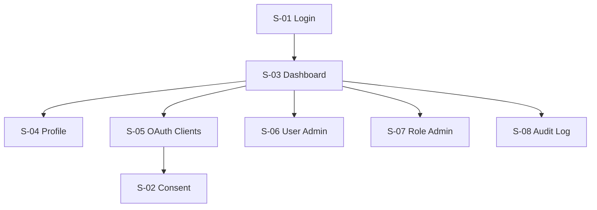
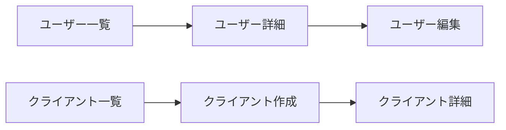
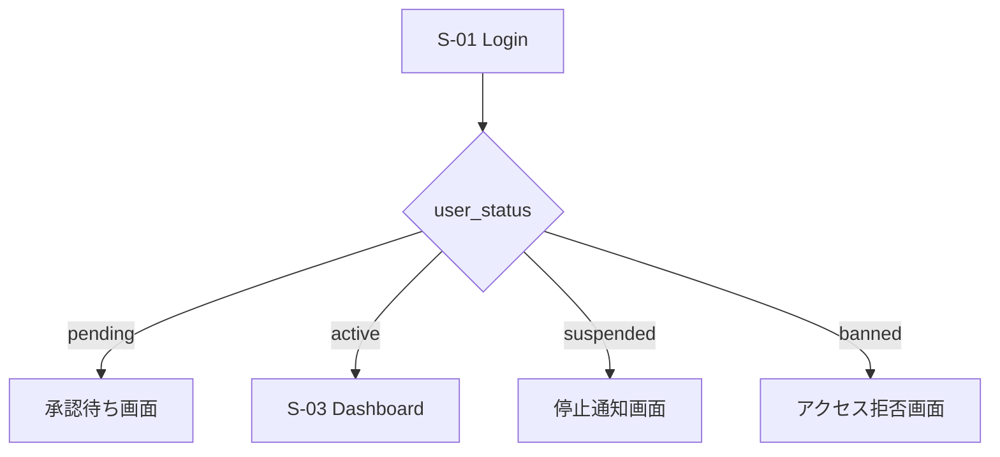
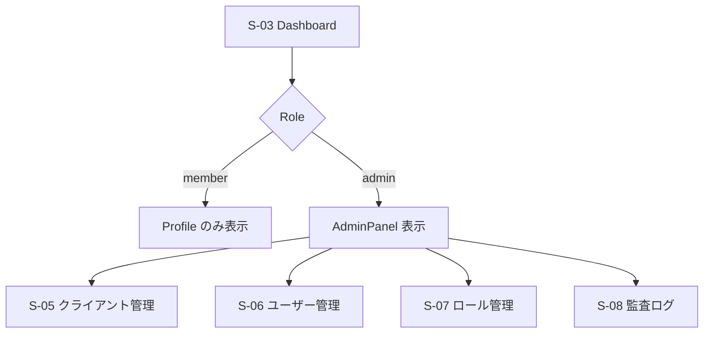
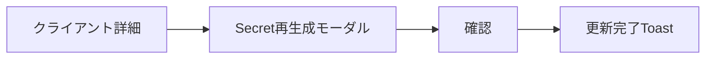
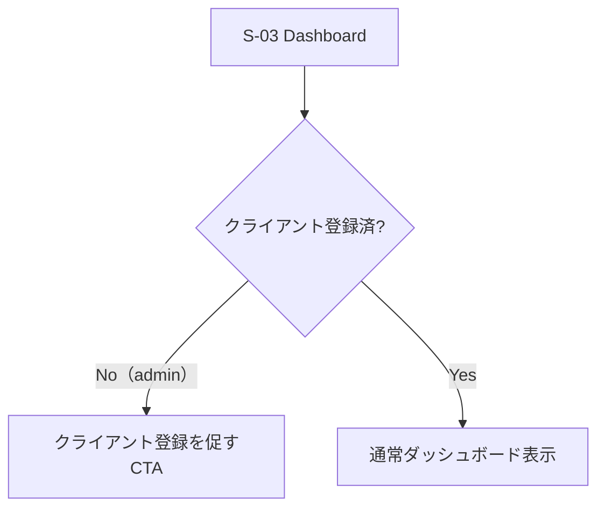

# 03 **🖥️ screen-flow.md テンプレート**

---

---

## 0️⃣ 設計前提

| 項目 | 内容 |
| --- | --- |
| 対象ユーザー | 未ログイン / 部員（member）/ 管理者（admin） |
| デバイス | Desktop中心（管理UI前提）/ Responsive |
| 認証要否 | 基本全面認証制（`/login` のみ公開） |
| 権限制御 | RBAC（admin / member） |
| MVP範囲 | P0画面のみ（OIDC成立に必要なUI） |

---

## 1️⃣ 画面一覧（Screen Inventory）

| ID | 画面名 | 役割 | 認証 | 優先度 |
| --- | --- | --- | --- | --- |
| S-01 | ログイン | username + password 入口 | 不要 | P0 |
| S-02 | 認可確認画面 | OAuthスコープ同意 | 必須 | P0 |
| S-03 | ダッシュボード | ユーザー中心画面 | 必須 | P0 |
| S-04 | プロフィール | 自分の情報確認・編集 | 必須 | P0 |
| S-05 | クライアント管理 | OAuthアプリ登録（管理者） | 管理者 | P0 |
| S-06 | ユーザー管理 | 部員管理・status変更（管理者） | 管理者 | P1 |
| S-07 | ロール管理 | admin / member 制御（管理者） | 管理者 | P1 |
| S-08 | 監査ログ | ログイン履歴確認（管理者） | 管理者 | P2 |

> **変更点：** S-01をDiscordログインからusername+passwordログインに変更。S-05（Identity管理）をDiscord連携不要のため削除。IDを詰めて再番号付け。
> 

---

## 2️⃣ 全体遷移図（高レベル）



---

## 3️⃣ 認証フロー（OIDCフロー）

```mermaid
flowchart LR
    App[部内アプリ]
    Authorize[/oauth/authorize]
    Login[S-01 Login]
    Consent[S-02 Consent]
    Token[/oauth/token]
    AppHome[アプリ画面]

    App --> Authorize
    Authorize --> Login
    Login --> Consent
    Consent --> Token
    Token --> AppHome
```

---

## 4️⃣ CRUD標準遷移



---

## 5️⃣ 状態別分岐（user_status）

ログイン後、`user_status` によって遷移先が分岐します。



> **pending の扱い：** 管理者がS-06ユーザー管理からactiveに変更するまでログイン後の操作はできない。
> 

---

## 6️⃣ 権限別分岐（RBAC）



---

## 7️⃣ モーダル・非同期操作



---

## 8️⃣ エラーフロー（OAuth）

```mermaid
flowchart TD
    Authorize[/oauth/authorize] --> ValidateClient{クライアント検証}
    ValidateClient -->|Invalid| ErrorPage[エラーページ]
    ValidateClient -->|Valid| IssueCode[認可コード発行]
    IssueCode --> Token[/oauth/token]
    Token -->|InvalidCode| OAuthError[OAuthエラーレスポンス]
    Token -->|Success| ReturnToApp[アプリへリダイレクト]
```

---

## 9️⃣ 空状態 / 初回体験



> **変更点：** Discord連携チェックを削除。adminが最初にクライアント（じょぎろぐ等）を登録するフローを初回体験として設定。
> 

---

## 🔟 モバイル考慮

| 項目 | Desktop | Mobile |
| --- | --- | --- |
| ナビゲーション | Sidebar | Drawer |
| クライアント管理 | テーブル表示 | 縦カード |
| 認可画面 | 詳細スコープ表示 | 簡易表示 |
| ユーザー管理 | テーブル表示 | 縦カード |

---

## 1️⃣1️⃣ URL設計

```
# 一般
/login
/dashboard
/profile

# 管理者
/admin/users
/admin/clients
/admin/roles
/admin/audit-logs

# OAuth / OIDC
/oauth/authorize
/oauth/token
/oauth/consent

# 公開エンドポイント
/.well-known/openid-configuration
/.well-known/jwks.json
```

> **変更点：** `/identities` を削除。`/admin/audit-logs` を追加。
> 

---

## 変更サマリー（01・02との整合）
| 変更箇所 | 変更内容 | 理由 |
| :--- | :--- | :--- |
| **S-01 ログイン画面** | Discordログイン → username+password | Discord連携なし |
| **S-05** | Identity管理画面を削除 | Discord連携なし |
| **S番号** | 全体を詰めて再番号付け | 欠番防止 |
| **URL** | `/identities` 削除 | Discord連携なし |
| **初回体験フロー** | Discord連携チェック → クライアント登録CTA | Discord連携なし |
| **状態分岐** | pendingの説明を追記 | 01のA-2・Phase 0と整合 |