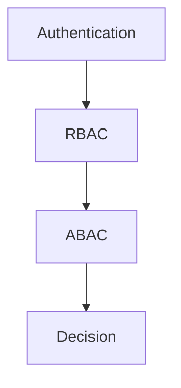

# 🔐 権限設計

---

# 0️⃣ 設計前提

| 項目      | 内容                               |
| ------- | -------------------------------- |
| 権限モデル   | RBAC / ABAC / Hybrid             |
| マルチテナント | あり / なし                          |
| 認証方式    | JWT / Session / OAuth            |
| スコープ単位  | Global / Organization / Resource |
| MVP方針   | P0は最小ロールのみ                       |

---

# 1️⃣ 用語定義

| 用語       | 意味                                |
| -------- | --------------------------------- |
| Subject  | 操作主体（User / System）               |
| Resource | 操作対象（Entity）                      |
| Action   | 操作内容（create/read/update/delete 等） |
| Role     | 権限グループ                            |
| Policy   | 条件付き許可ルール                         |

---

# 2️⃣ 権限レイヤー構造



---

# 3️⃣ RBAC設計テンプレ

## 3-1. グローバルロール

| ロール名        | レベル | 説明     |
| ----------- | --- | ------ |
| SUPER_ADMIN | 100 | 全操作可能  |
| ADMIN       | 80  | 管理操作可能 |
| MEMBER      | 50  | 一般利用   |
| GUEST       | 10  | 閲覧のみ   |

---

## 3-2. スコープロール（組織単位）

| ロール名   | レベル | 説明   |
| ------ | --- | ---- |
| OWNER  | 50  | 組織全権 |
| EDITOR | 30  | 編集可  |
| VIEWER | 10  | 閲覧のみ |

---

## 3-3. RBAC判定ロジック（抽象）

```pseudo
if user.role.level >= required_level:
    allow
else:
    deny
```

---

# 4️⃣ ABAC設計テンプレ

## 4-1. 条件モデル

```json
{
  "subject.role": "EDITOR",
  "resource.status": "draft",
  "environment.time": "<= deadline",
  "tenant_id": "match"
}
```

---

## 4-2. ポリシーテーブル例

| ID | 名前             | Action        | 条件              | Effect | Priority |
| -- | -------------- | ------------- | --------------- | ------ | -------- |
| 1  | DraftOnlyEdit  | entity:update | status=draft    | allow  | 10       |
| 2  | OwnerOverride  | *             | role=OWNER      | allow  | 5        |
| 3  | TenantBoundary | *             | tenant_mismatch | deny   | 1        |

---

## 4-3. 判定順序

```pseudo
1. 認証確認
2. テナント一致確認
3. RBAC判定
4. ABAC条件評価（priority順）
5. 最終Decision
```

---

# 5️⃣ ハイブリッド設計パターン

| レイヤー         | 用途              |
| ------------ | --------------- |
| RBAC         | 大枠制御（ロールレベル）    |
| ABAC         | 状態・所有者・時間など動的条件 |
| Feature Flag | 実験的制御           |

---

# 6️⃣ 代表的ルールテンプレ

### 6-1. 所有者のみ編集可

```pseudo
if resource.owner_id == user.id:
    allow
```

---

### 6-2. ステータスロック

```pseudo
if resource.status == "confirmed":
    deny update
```

---

### 6-3. テナント境界

```pseudo
if resource.tenant_id != user.tenant_id:
    deny
```

---

### 6-4. 自分のデータのみ閲覧

```pseudo
if resource.user_id == user.id:
    allow
```

---

# 7️⃣ データモデル連携テンプレ

| ルール    | 参照カラム            |
| ------ | ---------------- |
| 所有者制御  | entity.owner_id  |
| 状態制御   | entity.status    |
| テナント制御 | entity.tenant_id |
| 組織制御   | group_members    |

---

# 8️⃣ ログ設計

## 8-1. ABAC評価ログ

| フィールド          | 内容         |
| -------------- | ---------- |
| user_id        |            |
| action         |            |
| resource_type  |            |
| resource_id    |            |
| matched_policy |            |
| result         | allow/deny |
| timestamp      |            |

---

## 8-2. 監査ログ

| フィールド  | 内容        |
| ------ | --------- |
| who    | user      |
| what   | action    |
| where  | resource  |
| result | decision  |
| ip     | client_ip |

---

# 9️⃣ APIレイヤー統合

```typescript
function authorize(user, action, resource) {
  if (!isAuthenticated(user)) throw 401
  if (!tenantMatch(user, resource)) throw 403
  if (!rbacAllow(user, action)) throw 403
  if (!abacAllow(user, action, resource)) throw 403
}
```

---

# 🔟 フロントエンド制御

| パターン | 説明         |
| ---- | ---------- |
| 非表示  | ボタンを出さない   |
| 無効化  | disabled表示 |
| 警告   | warn表示     |

※ フロントはUX制御のみ。最終判定は必ずサーバー側。
