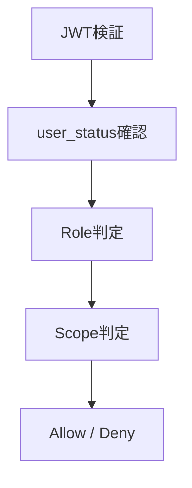

# 04 **🔐 権限設計**

---

## 0️⃣ 設計前提

| 項目 | 内容 |
| --- | --- |
| 権限モデル | RBAC中心 |
| マルチテナント | なし（単一部活組織） |
| 認証方式 | OIDC（JWT: RS256） |
| スコープ単位 | Global（OAuth scope）+ Resource |
| MVP方針 | P0は最小ロール（admin / member） |

---

## 1️⃣ 用語定義

| 用語 | 意味 |
| --- | --- |
| Subject | 操作主体（部員ユーザー / 管理者） |
| Resource | 操作対象（users / oauth_clients 等） |
| Action | 操作内容（create / read / update / delete / approve 等） |
| Role | 権限グループ（admin / member） |
| Scope | OAuthトークンに付与されるアクセス範囲 |
| Policy | 条件付き許可ルール（将来拡張） |

---

## 2️⃣ 権限レイヤー構造



---

## 3️⃣ RBAC設計

### 3-1. グローバルロール

| ロール名 | レベル | 説明 |
| --- | --- | --- |
| ADMIN | 80 | ユーザー管理・クライアント管理可 |
| MEMBER | 50 | 自身の情報閲覧・利用のみ |

### 3-2. ロール付与モデル

```
users
roles
user_roles
```

> `users.role`（MVPなら1カラムで十分）
> 

### 3-3. RBAC判定ロジック

```
if user.status != "active":
    deny

if user.role == "ADMIN":
    allow

if action in member_allowed_actions:
    allow

deny
```

---

## 4️⃣ OAuth Scope設計

> OAuth基盤なので「Role」と「Scope」は分離する。
> 

### 4-1. 基本スコープ

| Scope | 説明 |
| --- | --- |
| openid | OIDC必須 |
| profile | ユーザー情報取得 |
| users:read | ユーザー閲覧 |
| users:write | ユーザー変更 |
| clients:read | OAuthクライアント閲覧 |
| clients:write | OAuthクライアント変更 |

### 4-2. 判定モデル

```
if required_scope not in token.scopes:
    deny
```

---

## 5️⃣ user_status 連動制御

| status | 挙動 |
| --- | --- |
| pending | ログイン不可（承認待ち画面） |
| active | 通常利用可 |
| suspended | APIアクセス拒否 |
| banned | 全拒否 |

---

## 6️⃣ 管理対象別アクセス制御

### 6-1. users テーブル

| 操作 | member | admin |
| --- | --- | --- |
| 自分の閲覧 | ✔ | ✔ |
| 他人閲覧 | ✖ | ✔ |
| 更新 | ✖ | ✔ |
| status変更 | ✖ | ✔ |

### 6-2. oauth_clients

| 操作 | member | admin |
| --- | --- | --- |
| 閲覧 | ✖ | ✔ |
| 作成 | ✖ | ✔ |
| secret再発行 | ✖ | ✔ |

### 6-3. identities

| 操作 | member | admin |
| --- | --- | --- |
| 自分の連携確認 | ✔ | ✔ |
| 自分の連携削除 | ✔ | ✔ |
| 他人の連携削除 | ✖ | ✔ |

---

## 7️⃣ 将来 ABAC 拡張ポイント（予約）

| ルール | 参照カラム |
| --- | --- |
| 所有者制御 | entity.owner_id |
| 状態制御 | entity.status |
| テナント制御 | entity.tenant_id |
| 組織制御 | group_members |

### 7-1. 所有者制御（将来）

```
if resource.user_id == user.id:
    allow
```

### 7-2. クライアント別制御

```
if token.client_id == resource.client_id:
    allow
```

---

## 8️⃣ ログ設計

### 8-1. 認可ログ（API単位）

| フィールド | 内容 |
| --- | --- |
| user_uuid | JWT sub |
| role |  |
| scopes |  |
| action |  |
| resource |  |
| result | allow / deny |
| timestamp |  |

### 8-2. セキュリティ監査ログ

| フィールド | 内容 |
| --- | --- |
| user_uuid |  |
| event | login / token_issue / revoke |
| client_id |  |
| ip |  |
| user_agent |  |
| timestamp |  |

---

## 9️⃣ APIレイヤー統合

```rust
fn authorize(user: User, required_scope: &str, required_role: Role) -> Result<()> {
    if user.status != Active { return Err(403); }

    if !user.has_role(required_role) { return Err(403); }

    if !user.token.scopes.contains(required_scope) { return Err(403); }

    Ok(())
}
```

---

## 🔟 フロントエンド制御

| パターン | 説明 |
| --- | --- |
| 非表示 | admin以外は管理メニュー非表示 |
| 無効化 | 操作不可ボタン |
| 警告 | 権限不足メッセージ |

> ⚠️ フロントはUX制御のみ。最終判定は必ずサーバー側。
>