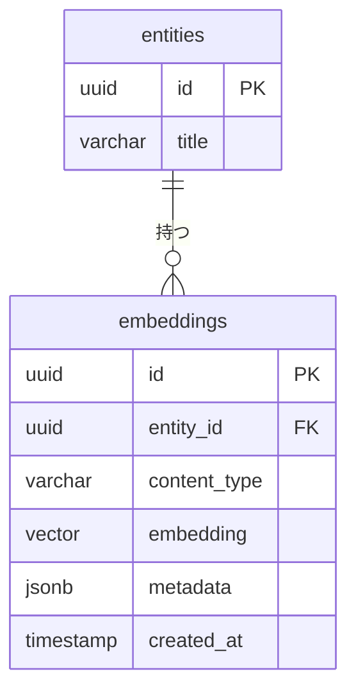
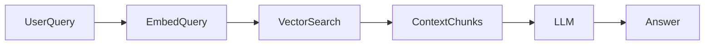

# 🗄️ DB設計書テンプレート

---

# 0️⃣ 設計観点

| 項目      | 内容                                    |
| ------- | ------------------------------------- |
| 権限モデル   | RBAC / ABAC / Hybrid                  |
| ID戦略    | UUID / ULID / Auto Increment          |
| 論理削除    | 有 / 無                                 |
| 監査ログ    | 必須 / 任意                               |

---

# 1️⃣ テーブル一覧テンプレート

| ドメイン  | テーブル名             | 役割     | Phase |
| ----- | ----------------- | ------ | ----- |
| アカウント | users             | ユーザー主体 | P0    |
| 認可    | roles             | ロール定義  | P0    |
| 認可    | user_roles        | ロール付与  | P0    |
| 組織    | groups            | 組織/チーム | P0    |
| 組織    | group_members     | 所属関係   | P0    |
| コア機能  | entities          | 中核リソース | P0    |
| コア機能  | entity_relations  | 関係テーブル | P1    |
| 補助    | comments          | コメント   | P1    |
| 補助    | logs              | 操作ログ   | P0    |
| 通知    | notifications     | 通知管理   | P1    |
| 拡張    | custom_attributes | 拡張属性   | P2    |
| 監査    | audit_logs        | 監査ログ   | P0    |

---

# 2️⃣ ERDテンプレート（抽象版）

```mermaid
erDiagram

    users {
        id PK
        email UNIQUE
        name
        status
        created_at
        updated_at
    }

    roles {
        id PK
        name UNIQUE
        level
    }

    user_roles {
        user_id FK
        role_id FK
        granted_at
    }

    groups {
        id PK
        name
        status
        created_by FK
        created_at
    }

    group_members {
        id PK
        user_id FK
        group_id FK
        role
        joined_at
    }

    entities {
        id PK
        group_id FK
        title
        status
        created_by FK
        created_at
    }

    entity_relations {
        parent_id FK
        child_id FK
    }

    comments {
        id PK
        entity_id FK
        user_id FK
        body
        created_at
    }

    users ||--o{ user_roles
    roles ||--o{ user_roles
    users ||--o{ group_members
    groups ||--o{ group_members
    groups ||--o{ entities
    entities ||--o{ comments
    entities ||--o{ entity_relations
```

---

# 3️⃣ カラム定義テンプレート

## users

| カラム        | 型         | 制約              | 説明              |
| ---------- | --------- | --------------- | --------------- |
| id         | UUID      | PK              |                 |
| email      | VARCHAR   | UNIQUE NOT NULL |                 |
| name       | VARCHAR   | NOT NULL        |                 |
| status     | ENUM      | NOT NULL        | active/inactive |
| created_at | TIMESTAMP | NOT NULL        |                 |
| updated_at | TIMESTAMP | NOT NULL        |                 |

---

## roles

| カラム   | 型        | 制約       | 説明        |
| ----- | -------- | -------- | --------- |
| id    | SMALLINT | PK       |           |
| name  | VARCHAR  | UNIQUE   |           |
| level | SMALLINT | NOT NULL | 数値が高いほど強い |

---

## entities（コアリソース）

| カラム        | 型         | 制約       | 説明                    |
| ---------- | --------- | -------- | --------------------- |
| id         | UUID      | PK       |                       |
| group_id   | UUID      | FK       | 所属単位                  |
| title      | VARCHAR   | NOT NULL |                       |
| status     | ENUM      | NOT NULL | draft/active/archived |
| created_by | UUID      | FK       |                       |
| created_at | TIMESTAMP | NOT NULL |                       |
| updated_at | TIMESTAMP | NOT NULL |                       |

---

# 4️⃣ 権限設計テンプレート

## RBAC

* role.level 比較で許可判定

## ABAC（任意）

```json
{
  "subject.role": "EDITOR",
  "resource.status": "active",
  "environment.time": "<= deadline"
}
```

| テーブル        | 役割   |
| ----------- | ---- |
| policies    | 条件定義 |
| policy_logs | 評価ログ |


以下に、**超汎用DB設計テンプレートへベクトルDB設計を統合した拡張版**を示します。
特定用途（AI推薦・RAG・検索等）に依存しない抽象モデルです。

# 🧠 ベクトルDB設計テンプレート

## アーキテクチャ選択パターン

## A. 同一DB内（pgvector）

```
App
 └── PostgreSQL (RDB + Vector)
```

**メリット**

* トランザクション整合性
* シンプル

**デメリット**

* 大規模時のスケール制限

---

## 外部ベクトルDB分離

```
App
 ├── RDB（メタデータ）
 └── Vector DB（検索専用）
```

**メリット**

* 高速検索・水平スケール
* フィルタリング最適化

**デメリット**

* 整合性管理が必要

## ベクトル格納設計パターン

---

## 🔹 パターン1：既存テーブルに直接持つ（小規模向け）

```sql
ALTER TABLE entities
ADD COLUMN embedding VECTOR(1536);
```

**適用条件**

* 1エンティティ = 1ベクトル
* 更新頻度低い

---

## 🔹 パターン2：専用ベクトルテーブル（推奨）



---

## embeddings テーブル定義テンプレ

| カラム          | 型         | 説明                   |
| ------------ | --------- | -------------------- |
| id           | UUID      | PK                   |
| entity_id    | UUID      | 紐づくリソース              |
| content_type | VARCHAR   | title/body/comment 等 |
| embedding    | VECTOR(N) | ベクトル                 |
| metadata     | JSONB     | フィルタ用属性              |
| model_name   | VARCHAR   | 使用モデル                |
| created_at   | TIMESTAMP |                      |

---

# 3️⃣ メタデータ設計（検索フィルタ用）

```json
{
  "group_id": "uuid",
  "status": "active",
  "visibility": "public",
  "language": "ja",
  "created_by": "uuid"
}
```

※ RAGやマルチテナントでは必須

---

# 4️⃣ インデックス設計

## pgvector（Cosine距離）

```sql
CREATE INDEX idx_embeddings_vector
ON embeddings
USING ivfflat (embedding vector_cosine_ops)
WITH (lists = 100);
```

## HNSW（高速）

```sql
CREATE INDEX idx_embeddings_hnsw
ON embeddings
USING hnsw (embedding vector_cosine_ops);
```

---

# 5️⃣ クエリテンプレ

## 類似検索（TopK）

```sql
SELECT entity_id, 1 - (embedding <=> :query_vector) AS similarity
FROM embeddings
WHERE metadata->>'group_id' = :group_id
ORDER BY embedding <=> :query_vector
LIMIT 10;
```

---

# 6️⃣ 更新戦略テンプレ

| 戦略     | 説明          |
| ------ | ----------- |
| 同期更新   | レコード保存時に即生成 |
| 非同期キュー | 保存→Job→生成   |
| 再生成バッチ | モデル変更時に全更新  |

---

# 7️⃣ RAG設計テンプレ



---

## チャンク設計指針

| 項目      | 推奨             |
| ------- | -------------- |
| 文字数     | 300〜800 tokens |
| オーバーラップ | 10〜20%         |
| 単位      | 意味単位（段落）       |

---

# 8️⃣ 多ベクトル対応

用途別に分ける：

| 種類                  | 例      |
| ------------------- | ------ |
| semantic_vector     | 本文検索   |
| keyword_vector      | タイトル重視 |
| user_profile_vector | レコメンド  |
| skill_vector        | マッチング  |

```sql
vector_semantic VECTOR(1536),
vector_title VECTOR(1536)
```
