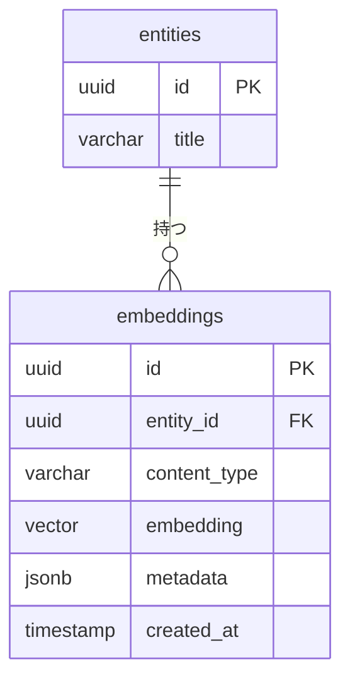
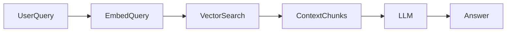

# 05 **DB設計書テンプレート**

# 0️⃣ 設計観点

---

| 項目 | 内容 |
| --- | --- |
| 権限モデル | RBAC（admin/member）+ OAuth Scope（API制御） |
| ID戦略 | 内部: BIGINT IDENTITY / 外部公開: UUID（users.uuid） |
| 論理削除 | 有（deleted_at） |
| 監査ログ | 必須（監査 + 認可イベント） |

---

## 1️⃣ テーブル一覧

| ドメイン | テーブル名 | 役割 | Phase |
| --- | --- | --- | --- |
| アカウント | users | ユーザーの存在 | P0 |
| 認証 | user_credentials | ログインの情報 | P0 |
| プロフィール | user_profile | ユーザー情報 | P2 |
| ロール定義 | roles | ロールの定義 | P0 |
| ロール設定 | user_roles | ロール付与 | P0 |
| OAuth | oauth_clients | 部内アプリ登録 | P0 |
| OAuth | oauth_client_redirect_uris | リダイレクトURI管理 | P0 |
| OAuth | oauth_authorization_codes | 認可コード（PKCE） | P0 |
| OAuth | oauth_refresh_tokens | Refresh Token（ハッシュ保存） | P0 |
| 公開鍵 | signing_keys | JWKS用鍵管理（ローテ用） | P1 |
| 監査 | audit_logs | 監査ログ（管理操作/重要イベント） | P0 |
| セキュリティ | auth_events | ログイン/トークン発行イベント | P1 |
| 拡張 | oauth_scopes | スコープ定義（任意） | P1 |
| 拡張 | oauth_client_scopes | クライアント許可スコープ | P1 |
|  |  |  |  |
|  |  |  |  |

---

## 2️⃣ ERD（OIDC/OAuth）

### USERS テーブル

```mermaid
erDiagram
    users {
        BIGINT id "PK"
        UUID uuid "UNIQUE, NOT NULL"
        user_status status "NOT NULL"
        TIMESTAMPTZ created_at "Default: NOW()"
        TIMESTAMPTZ updated_at "Default: NOW()"
        TIMESTAMPTZ deleted_at
    }

    user_credentials {
        BIGINT id "PK"
        BIGINT user_id "FK"
        VARCHAR type "NOT NULL (password|totp|webauthn)"
        TEXT secret_hash "NOT NULL"
        JSONB secret_meta
        BOOLEAN is_primary "Default: false"
        TIMESTAMPTZ last_used_at
        TIMESTAMPTZ verified_at
        TIMESTAMPTZ revoked_at
        TIMESTAMPTZ created_at "Default: NOW()"
        TIMESTAMPTZ updated_at "Default: NOW()"
    }

    user_profile {
        BIGINT user_id "PK, FK"
        VARCHAR display_name "NOT NULL"
        VARCHAR username "UNIQUE"
        VARCHAR avatar_url
        TEXT bio
        VARCHAR locale "Default: 'ja-JP'"
        VARCHAR timezone "Default: 'Asia/Tokyo'"
        TIMESTAMPTZ created_at "Default: NOW()"
        TIMESTAMPTZ updated_at "Default: NOW()"
    }

    roles {
        BIGINT id "PK"
        VARCHAR name "UNIQUE, NOT NULL"
        TEXT description
        TIMESTAMPTZ created_at
        TIMESTAMPTZ updated_at
    }

    user_roles {
        BIGINT user_id "PK, FK"
        BIGINT role_id "PK, FK"
        TIMESTAMPTZ created_at
    }

    oauth_clients {
        BIGINT id "PK"
        VARCHAR client_id "UNIQUE, NOT NULL"
        VARCHAR client_name "NOT NULL"
        VARCHAR client_type "NOT NULL (public|confidential)"
        TEXT client_secret_hash
        TIMESTAMPTZ created_at "Default: NOW()"
        TIMESTAMPTZ updated_at "Default: NOW()"
    }

    oauth_client_redirect_uris {
        BIGINT id "PK"
        BIGINT client_id "FK"
        TEXT redirect_uri "NOT NULL"
        VARCHAR environment
        TIMESTAMPTZ created_at "Default: NOW()"
    }

    oauth_authorization_codes {
        BIGINT id "PK"
        BIGINT user_id "FK"
        BIGINT client_id "FK"
        TEXT code_hash "NOT NULL"
        TEXT code_challenge
        VARCHAR code_challenge_method
        TEXT redirect_uri "NOT NULL"
        TIMESTAMPTZ expires_at "NOT NULL"
        TIMESTAMPTZ consumed_at
        TIMESTAMPTZ created_at "Default: NOW()"
    }

    oauth_refresh_tokens {
        BIGINT id "PK"
        BIGINT user_id "FK"
        BIGINT client_id "FK"
        TEXT token_hash "NOT NULL"
        TIMESTAMPTZ expires_at "NOT NULL"
        TIMESTAMPTZ revoked_at
        TIMESTAMPTZ created_at "Default: NOW()"
    }

    signing_keys {
        BIGINT id "PK"
        VARCHAR kid "UNIQUE, NOT NULL"
        VARCHAR alg "NOT NULL (RS256|ES256)"
        TEXT public_jwk "NOT NULL"
        TEXT private_key_enc
        BOOLEAN is_active "Default: false"
        TIMESTAMPTZ not_before
        TIMESTAMPTZ expires_at
        TIMESTAMPTZ created_at "Default: NOW()"
    }

    audit_logs {
        BIGINT id "PK"
        BIGINT actor_user_id "FK"
        VARCHAR action "NOT NULL"
        VARCHAR target_type
        VARCHAR target_id
        JSONB before_json
        JSONB after_json
        INET ip_address
        TIMESTAMPTZ created_at "Default: NOW()"
    }

    auth_events {
        BIGINT id "PK"
        BIGINT user_id "FK"
        BIGINT client_id "FK"
        VARCHAR event_type "NOT NULL"
        VARCHAR result "success|fail"
        INET ip_address
        TEXT user_agent
        TIMESTAMPTZ created_at "Default: NOW()"
    }

    oauth_scopes {
        BIGINT id "PK"
        VARCHAR name "UNIQUE, NOT NULL"
        TEXT description
        TIMESTAMPTZ created_at "Default: NOW()"
    }

    oauth_client_scopes {
        BIGINT client_id "PK, FK"
        BIGINT scope_id "PK, FK"
        TIMESTAMPTZ created_at "Default: NOW()"
    }

    users ||--o{ user_credentials : has
    users ||--|| user_profile : has
    users ||--o{ user_roles : assigned
    roles ||--o{ user_roles : includes

    oauth_clients ||--o{ oauth_client_redirect_uris : has
    users ||--o{ oauth_authorization_codes : issues
    oauth_clients ||--o{ oauth_authorization_codes : requests

    users ||--o{ oauth_refresh_tokens : owns
    oauth_clients ||--o{ oauth_refresh_tokens : issued_to

    users ||--o{ audit_logs : acts
    users ||--o{ auth_events : triggers
    oauth_clients ||--o{ auth_events : used_by

    oauth_clients ||--o{ oauth_client_scopes : allows
    oauth_scopes ||--o{ oauth_client_scopes : defines
```



---

## 3️⃣ カラム定義

### users

| カラム | 型 | 制約 | 説明 |
| --- | --- | --- | --- |
| id | BIGINT | PK | 内部ID |
| uuid | UUID | UNIQUE NOT NULL | 外部公開ID（OIDC sub） |
| status | user_status | NOT NULL | pending/active/suspended/banned |
| created_at | TIMESTAMPTZ | NOT NULL |  |
| updated_at | TIMESTAMPTZ | NOT NULL | trigger更新 |
| deleted_at | TIMESTAMPTZ | NULL | 論理削除 |

### users

| カラム | 型 | 制約 | 説明 |
| --- | --- | --- | --- |
| id | BIGINT | PK | 内部ID |
| uuid | UUID | UNIQUE NOT NULL | 外部公開ID（OIDC sub） |
| status | user_status | NOT NULL | pending/active/suspended/banned |
| created_at | TIMESTAMPTZ | NOT NULL |  |
| updated_at | TIMESTAMPTZ | NOT NULL | trigger更新 |
| deleted_at | TIMESTAMPTZ | NULL | 論理削除 |

### roles

| カラム | 型 | 制約 | 説明 |
| --- | --- | --- | --- |
| id | SMALLINT | PK |  |
| name | VARCHAR | UNIQUE |  |
| level | SMALLINT | NOT NULL | 数値が高いほど強い |

### entities（コアリソース）

| カラム | 型 | 制約 | 説明 |
| --- | --- | --- | --- |
| id | UUID | PK |  |
| group_id | UUID | FK | 所属単位 |
| title | VARCHAR | NOT NULL |  |
| status | ENUM | NOT NULL | draft/active/archived |
| created_by | UUID | FK |  |
| created_at | TIMESTAMP | NOT NULL |  |
| updated_at | TIMESTAMP | NOT NULL |  |

---

## 4️⃣ 権限設計

### RBAC

- role.level 比較で許可判定

### ABAC（任意）

```json
{
  "subject.role": "EDITOR",
  "resource.status": "active",
  "environment.time": "<= deadline"
}
```

| テーブル | 役割 |
| --- | --- |
| policies | 条件定義 |
| policy_logs | 評価ログ |

---

# 🧠 ベクトルDB設計テンプレート

---

## アーキテクチャ選択パターン

### A. 同一DB内（pgvector）

```
App
 └── PostgreSQL (RDB + Vector)
```

|  |  |
| --- | --- |
| メリット | トランザクション整合性・シンプル |
| デメリット | 大規模時のスケール制限 |

### B. 外部ベクトルDB分離

```
App
 ├── RDB（メタデータ）
 └── Vector DB（検索専用）
```

|  |  |
| --- | --- |
| メリット | 高速検索・水平スケール・フィルタリング最適化 |
| デメリット | 整合性管理が必要 |

---

## ベクトル格納設計パターン

### 🔹 パターン1：既存テーブルに直接持つ（小規模向け）

```sql
ALTER TABLE entities
ADD COLUMN embedding VECTOR(1536);
```

> **適用条件：** 1エンティティ = 1ベクトル、更新頻度低い
> 

### 🔹 パターン2：専用ベクトルテーブル（推奨）



### embeddings テーブル定義

| カラム | 型 | 説明 |
| --- | --- | --- |
| id | UUID | PK |
| entity_id | UUID | 紐づくリソース |
| content_type | VARCHAR | title/body/comment 等 |
| embedding | VECTOR(N) | ベクトル |
| metadata | JSONB | フィルタ用属性 |
| model_name | VARCHAR | 使用モデル |
| created_at | TIMESTAMP |  |

---

## メタデータ設計（検索フィルタ用）

```json
{
  "group_id": "uuid",
  "status": "active",
  "visibility": "public",
  "language": "ja",
  "created_by": "uuid"
}
```

> RAGやマルチテナントでは必須
> 

---

## インデックス設計

### pgvector（Cosine距離）

```sql
CREATE INDEX idx_embeddings_vector
ON embeddings
USING ivfflat (embedding vector_cosine_ops)
WITH (lists = 100);
```

### HNSW（高速）

```sql
CREATE INDEX idx_embeddings_hnsw
ON embeddings
USING hnsw (embedding vector_cosine_ops);
```

---

## クエリテンプレート

### 類似検索（TopK）

```sql
SELECT entity_id, 1 - (embedding <=> :query_vector) AS similarity
FROM embeddings
WHERE metadata->>'group_id' = :group_id
ORDER BY embedding <=> :query_vector
LIMIT 10;
```

---

## 更新戦略

| 戦略 | 説明 |
| --- | --- |
| 同期更新 | レコード保存時に即生成 |
| 非同期キュー | 保存 → Job → 生成 |
| 再生成バッチ | モデル変更時に全更新 |

---

## RAG設計



### チャンク設計指針

| 項目 | 推奨 |
| --- | --- |
| 文字数 | 300〜800 tokens |
| オーバーラップ | 10〜20% |
| 単位 | 意味単位（段落） |

---

## 多ベクトル対応