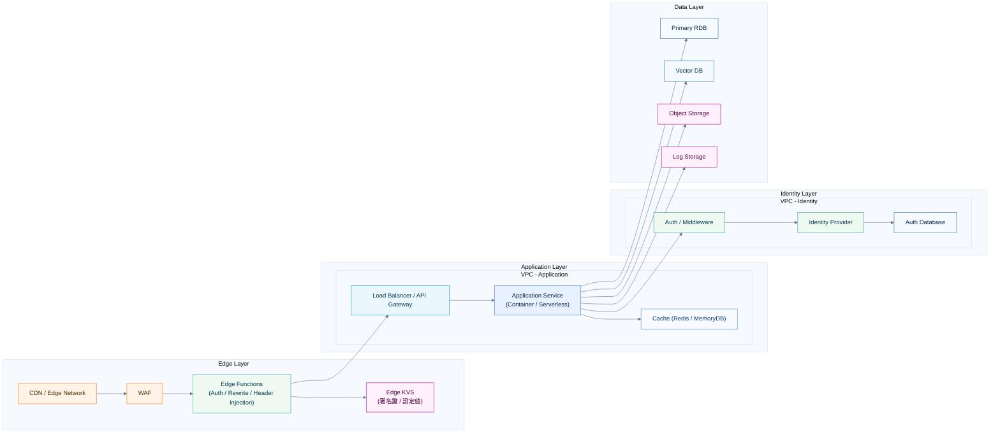

# Infrastructure Guidelines

---

# System Architecture

---

# System Components

---

## 1️⃣ Edge Layer

### CDN / Edge Network

* 静的アセット配信
* TLS終端
* キャッシュ
* 地理的最適化

### Edge Functions

役割：

* JWT検証（可能ならEdgeで）
* ヘッダー注入
* リライト
* 早期Reject（Unauthorized）

設計意図：

* 全リクエストにかかる処理はEdgeへ
* オリジン負荷軽減
* レイテンシ最小化

---

## 2️⃣ Application Layer

### Application Service

* Container (ECS/Kubernetes)
* Serverless (Cloud Run/Lambda)
* またはVM

責務：

* ビジネスロジック
* API処理
* 権限チェック（最終判定）

### Cache

用途：

* セッション
* 頻繁参照データ
* レート制限

---

## 3️⃣ Identity Layer（分離推奨）

* Auth Middleware
* Identity Provider

設計原則：

| 原則         | 理由         |
| ---------- | ---------- |
| アプリと分離     | 将来のIDP差し替え |
| 独立スケール     | 認証集中時間帯対応  |
| DB直接アクセス禁止 | 責任分離       |

---

## 4️⃣ Data Layer

| コンポーネント        | 用途         |
| -------------- | ---------- |
| RDB            | トランザクション   |
| Vector DB      | 類似検索 / RAG |
| Object Storage | ファイル       |
| Log Storage    | 監査・分析      |

---

# 設計意図

---

## 認可処理を高速化するために

### EdgeでJWT検証

* DBアクセス不要
* KVSに署名鍵保持
* Stateless認可

理由：

* 認可は全リクエストに発生
* レイテンシ削減が最重要

---

## IdentityとApplicationの分離

### なぜ分離するか？

* 外部IDP切替可能
* アプリロジックと認証ロジック分離
* セキュリティ境界明確化

---

## Containerを使う理由（Lambdaではなく）

### Lambdaの課題

* コールドスタート
* DB接続枯渇
* NAT経由問題

### Containerの利点

* コネクションプーリング
* VPC内完結
* 長時間接続可能

---

## VectorDBを分離する理由

* 類似検索は高CPU負荷
* RDBと負荷特性が違う
* 将来スケール前提

---

## Cacheを利用する理由

* トークン検証後のセッション短期保存
* レート制限
* 読み取り最適化

---

# スケーリング戦略

---

## 水平スケール

| レイヤー   | 方法              |
| ------ | --------------- |
| Edge   | 自動スケール          |
| App    | Auto Scaling    |
| DB     | Read Replica    |
| Vector | HNSW / Sharding |

---

## 局所アクセス対策

* 事前Warm-up
* Scheduled Scale
* Connection Pool管理
