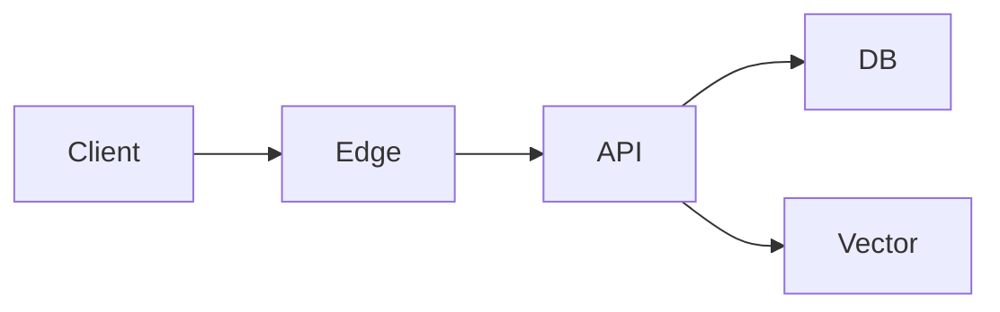
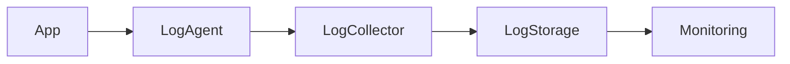

# 📘 ログ設計テンプレート

---

# 0️⃣ 設計前提

| 項目     | 内容                       |
| ------ | ------------------------ |
| 対象システム | Web / API / Batch / Edge |
| ログ方式   | 構造化ログ（JSON）必須            |
| 集約方式   | Centralized Logging      |
| 保持期間   | 30日 / 90日 / 1年           |
| 個人情報   | マスキング必須                  |

---

# 1️⃣ ログ分類

| 種別                 | 目的        | 出力対象   |
| ------------------ | --------- | ------ |
| Application Log    | 動作確認・デバッグ | 開発・運用  |
| Access Log         | リクエスト追跡   | 運用     |
| Audit Log          | セキュリティ監査  | セキュリティ |
| Security Log       | 異常検知      | SOC    |
| Business Log       | KPI分析     | BI     |
| Infrastructure Log | リソース監視    | SRE    |

---

# 2️⃣ ログレベル定義

| レベル   | 用途          |
| ----- | ----------- |
| DEBUG | 詳細情報（本番無効可） |
| INFO  | 正常動作        |
| WARN  | 想定内の異常      |
| ERROR | 処理失敗        |
| FATAL | サービス停止級     |

---

# 3️⃣ 構造化ログフォーマット（JSON標準）

```json
{
  "timestamp": "2025-01-01T10:00:00Z",
  "level": "INFO",
  "service": "api-service",
  "environment": "prod",
  "trace_id": "uuid",
  "user_id": "uuid",
  "tenant_id": "uuid",
  "action": "entity.update",
  "resource_type": "entity",
  "resource_id": "uuid",
  "message": "Entity updated successfully",
  "metadata": {}
}
```

---

# 4️⃣ 必須フィールド

| フィールド     | 理由         |
| --------- | ---------- |
| timestamp | 時系列追跡      |
| level     | 重要度        |
| service   | マイクロサービス識別 |
| trace_id  | 分散トレーシング   |
| user_id   | 監査         |
| tenant_id | マルチテナント    |
| action    | 操作識別       |

---

# 5️⃣ Application Log設計

### 目的

* デバッグ
* 障害解析

### 出力例

```json
{
  "level": "ERROR",
  "service": "api",
  "trace_id": "abc-123",
  "message": "Database connection failed",
  "error_code": "DB_CONN_TIMEOUT"
}
```

---

# 6️⃣ Access Log設計

```json
{
  "timestamp": "...",
  "method": "POST",
  "path": "/api/entities",
  "status": 200,
  "latency_ms": 120,
  "ip": "xxx.xxx.xxx.xxx",
  "user_agent": "...",
  "trace_id": "..."
}
```

---

# 7️⃣ Audit Log設計（重要）

### 対象操作

* ロール変更
* データ削除
* 設定変更
* 認証失敗

```json
{
  "timestamp": "...",
  "user_id": "uuid",
  "action": "role.grant",
  "resource_type": "user",
  "resource_id": "uuid",
  "before": {"role": "member"},
  "after": {"role": "admin"},
  "result": "allow",
  "ip": "..."
}
```

---

# 8️⃣ セキュリティログ

| イベント      | 記録 |
| --------- | -- |
| ログイン失敗    | 必須 |
| 異常アクセス    | 必須 |
| レート制限発動   | 推奨 |
| ABAC deny | 推奨 |

---

# 9️⃣ 分散トレーシング設計



### trace_id必須

* 全サービスで引き継ぐ
* HTTP Headerで伝播

---

# 🔟 ログ保存構成



---

# 11️⃣ 保持ポリシー

| 種類          | 保持期間 |
| ----------- | ---- |
| Application | 30日  |
| Access      | 90日  |
| Audit       | 1年以上 |
| Security    | 1年以上 |

---

# 12️⃣ マスキングポリシー

| 対象    | 方針       |
| ----- | -------- |
| パスワード | 絶対出力禁止   |
| トークン  | マスク      |
| メール   | ハッシュ化    |
| IP    | 必要に応じ匿名化 |

---

# 13️⃣ フェーズ導入

```text
Phase0:
- Application Log
- Access Log
- 最低限のAudit Log

Phase1:
- 構造化ログ統一
- Centralized Logging

Phase2:
- 分散トレーシング
- セキュリティイベント自動検知

Phase3:
- SIEM連携
- 異常検知AI
```

---

# 14️⃣ コスト最適化

| 方法      | 説明        |
| ------- | --------- |
| DEBUG無効 | 本番削減      |
| サンプリング  | 高トラフィック対策 |
| ローテーション | 古いログ圧縮    |
