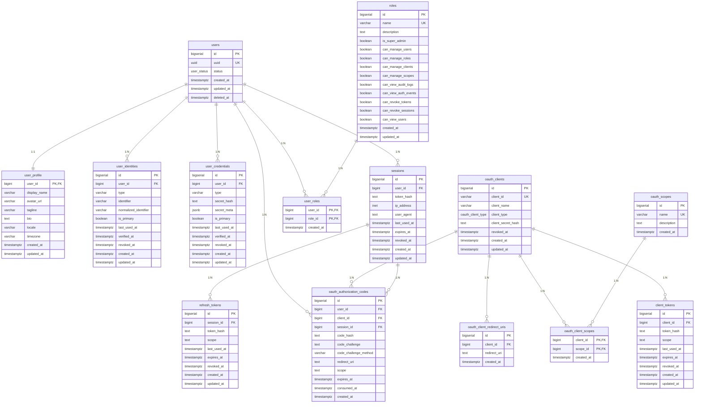

```mermaid
erDiagram
    users {
        bigserial id PK
        uuid uuid UK
        user_status status
        timestamptz created_at
        timestamptz updated_at
        timestamptz deleted_at
    }
    user_profile {
        bigint user_id PK,FK
        varchar display_name
        varchar avatar_url
        varchar tagline
        text bio
        varchar locale
        varchar timezone
        timestamptz created_at
        timestamptz updated_at
    }
    user_identities {
        bigserial id PK
        bigint user_id FK
        varchar type
        varchar identifier
        varchar normalized_identifier
        boolean is_primary
        timestamptz last_used_at
        timestamptz verified_at
        timestamptz revoked_at
        timestamptz created_at
        timestamptz updated_at
    }
    user_credentials {
        bigserial id PK
        bigint user_id FK
        varchar type
        text secret_hash
        jsonb secret_meta
        boolean is_primary
        timestamptz last_used_at
        timestamptz verified_at
        timestamptz revoked_at
        timestamptz created_at
        timestamptz updated_at
    }
    sessions {
        bigserial id PK
        bigint user_id FK
        text token_hash
        inet ip_address
        text user_agent
        timestamptz last_used_at
        timestamptz expires_at
        timestamptz revoked_at
        timestamptz created_at
        timestamptz updated_at
    }
    refresh_tokens {
        bigserial id PK
        bigint session_id FK
        text token_hash
        text scope
        timestamptz last_used_at
        timestamptz expires_at
        timestamptz revoked_at
        timestamptz created_at
        timestamptz updated_at
    }
    roles {
        bigserial id PK
        varchar name UK
        text description
        boolean is_super_admin
        boolean can_manage_users
        boolean can_manage_roles
        boolean can_manage_clients
        boolean can_manage_scopes
        boolean can_view_audit_logs
        boolean can_view_auth_events
        boolean can_revoke_tokens
        boolean can_revoke_sessions
        boolean can_view_users
        timestamptz created_at
        timestamptz updated_at
    }
    user_roles {
        bigint user_id PK,FK
        bigint role_id PK,FK
        timestamptz created_at
    }
    oauth_clients {
        bigserial id PK
        varchar client_id UK
        varchar client_name
        oauth_client_type client_type
        text client_secret_hash
        timestamptz revoked_at
        timestamptz created_at
        timestamptz updated_at
    }
    oauth_client_redirect_uris {
        bigserial id PK
        bigint client_id FK
        text redirect_uri
        timestamptz created_at
    }
    oauth_scopes {
        bigserial id PK
        varchar name UK
        text description
        timestamptz created_at
    }
    oauth_client_scopes {
        bigint client_id PK,FK
        bigint scope_id PK,FK
        timestamptz created_at
    }
    oauth_authorization_codes {
        bigserial id PK
        bigint user_id FK
        bigint client_id FK
        bigint session_id FK
        text code_hash
        text code_challenge
        varchar code_challenge_method
        text redirect_uri
        text scope
        timestamptz expires_at
        timestamptz consumed_at
        timestamptz created_at
    }
    client_tokens {
        bigserial id PK
        bigint client_id FK
        text token_hash
        text scope
        timestamptz last_used_at
        timestamptz expires_at
        timestamptz revoked_at
        timestamptz created_at
        timestamptz updated_at
    }

    users ||--|| user_profile : "1:1"
    users ||--o{ user_identities : "1:N"
    users ||--o{ user_credentials : "1:N"
    users ||--o{ sessions : "1:N"
    sessions ||--o{ refresh_tokens : "1:N"
    users ||--o{ user_roles : "1:N"
    roles ||--o{ user_roles : "1:N"
    oauth_clients ||--o{ oauth_client_redirect_uris : "1:N"
    oauth_clients ||--o{ oauth_client_scopes : "1:N"
    oauth_scopes ||--o{ oauth_client_scopes : "1:N"
    users ||--o{ oauth_authorization_codes : "1:N"
    oauth_clients ||--o{ oauth_authorization_codes : "1:N"
    sessions ||--o{ oauth_authorization_codes : "1:N"
    oauth_clients ||--o{ client_tokens : "1:N"
```