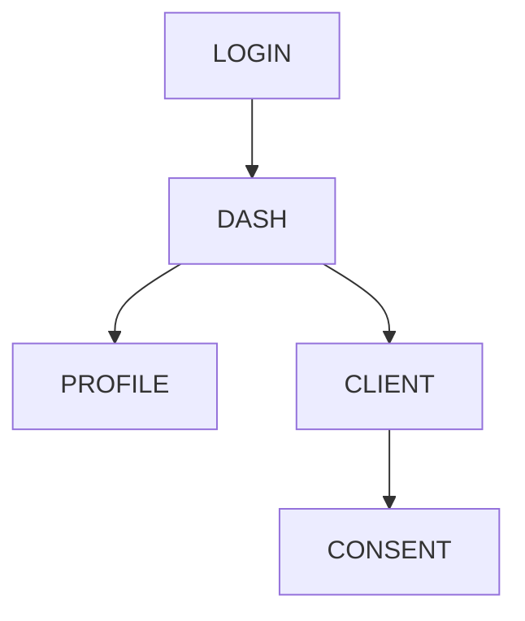
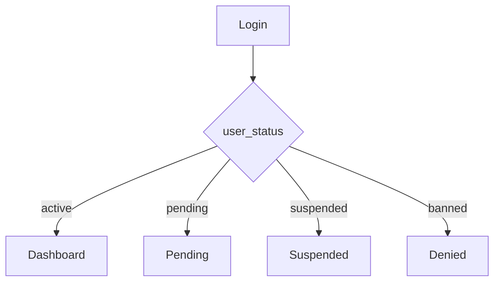
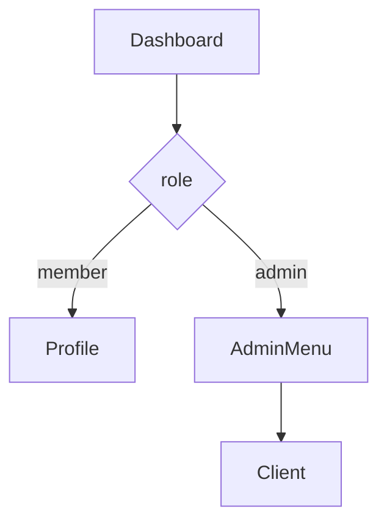

# 画面遷移

---

## 設計前提
| 項目 | 内容 |
| --- | --- |
| 対象ユーザー | 未ログイン / 部員（member）/ 管理者（admin） |
| デバイス | Desktop中心（管理UI前提）/ Responsive |
| 認証要否 | 基本全面認証制（`/login` のみ公開） |
| 権限制御 | RBAC（admin / member） |
| MVP範囲 | P0画面のみ（OAuth2成立に必要なUI） |

## 画面一覧（Screen Inventory）

| ID | 画面名 | 役割 | 認証 | 優先度 |
| --- | --- | --- | --- | --- |
| S-01 | ログイン | username + password 認証 | 不要 | 🔴 P0 |
| S-02 | 認可確認画面 | OAuthスコープ同意 | 必須 | 🔴 P0 |
| S-03 | ダッシュボード | ユーザーのホーム画面 | 必須 | 🔴 P0 |
| S-04 | プロフィール | 自分の情報確認・編集 | 必須 | 🔴 P0 |
| S-05 | クライアント管理 | OAuthクライアント登録（admin） | 管理者 | 🔴 P0 |
| S-06 | ユーザー管理 | ユーザー一覧・状態変更 | 管理者 | 🟡 P1 |
| S-07 | ロール管理 | 権限管理（RBAC） | 管理者 | 🟡 P1 |
| S-08 | エラー画面 | OAuth/認証エラー表示 | 不要 | 🔴 P0 |

## 認可コードフロー

```mermaid
flowchart LR
    Client[Client App]
    Auth[/oauth/authorize]
    Login[S-01 Login]
    Consent[S-02 Consent]
    Code[Authorization Code]
    Token[/oauth/token]
    Access[Access Token]

    Client --> Auth
    Auth --> Login
    Login --> Consent
    Consent --> Code
    Code --> Token
    Token --> Access
```

---

## 画面遷移



---

## 状態分岐



---

## RBAC



---

## URL

```
/login
/dashboard
/profile
/admin/clients
/oauth/authorize
/oauth/token
/oauth/consent
```

---

## 補足

- Authorization Code Flow準拠
- UIは `/authorize` 周りのみ必須
- `/token` はAPIのみ

---