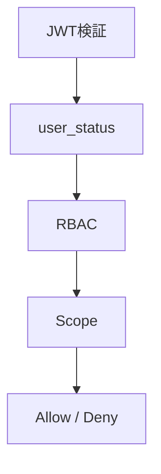

# 🔐 権限設計

---

## 設計前提

| 項目 | 内容 |
| --- | --- |
| 権限モデル | RBAC |
| マルチテナント | なし |
| 認証方式 | OIDC（JWT: RS256） |
| スコープ | OAuth ScopeでAPI制御 |
| MVP | admin / member |

---

## 用語

| 用語 | 意味 |
| --- | --- |
| Subject | ユーザー |
| Resource | 操作対象（users / oauth_clients） |
| Action | 操作（CRUD） |
| Role | 権限グループ |
| Scope | トークンのアクセス範囲 |

---

## 権限レイヤー



---

## RBAC

| ロール | 説明 |
| --- | --- |
| admin | 全操作可能 |
| member | 自分の情報のみ |

**判定**

```
if user.status != "active":
    deny

if user.role == "admin":
    allow

if action in allowed_for_member:
    allow

deny
```

---

## Scope

| Scope | 説明 |
| --- | --- |
| openid | OIDC |
| profile | ユーザー情報 |
| users:read | ユーザー閲覧 |
| users:write | ユーザー更新 |
| clients:read | クライアント閲覧 |
| clients:write | クライアント操作 |

**判定**

```
if required_scope not in token.scopes:
    deny
```

---

## user_status

| status | 挙動 |
| --- | --- |
| pending | 利用不可 |
| active | 利用可 |
| suspended | API拒否 |
| banned | 全拒否 |

---

## アクセス制御

### users

| 操作 | member | admin |
| --- | --- | --- |
| 自分の閲覧 | ✔ | ✔ |
| 他人閲覧 | ✖ | ✔ |
| 更新 | ✖ | ✔ |
| status変更 | ✖ | ✔ |

### oauth_clients

| 操作 | member | admin |
| --- | --- | --- |
| 閲覧 | ✖ | ✔ |
| 作成 | ✖ | ✔ |
| 更新 | ✖ | ✔ |

---

## ログ

### 認可ログ

| 項目 | 内容 |
| --- | --- |
| user_id | JWT sub |
| role |  |
| scopes |  |
| action |  |
| resource |  |
| result | allow / deny |
| timestamp |  |

### セキュリティログ

| 項目 | 内容 |
| --- | --- |
| user_id |  |
| event | login / token_issue / revoke |
| client_id |  |
| ip |  |
| user_agent |  |
| timestamp |  |

---

## API統合

```rust
fn authorize(user: User, required_scope: &str, required_role: Role) -> Result<()> {
    if user.status != Active { return Err(403); }

    if !user.has_role(required_role) { return Err(403); }

    if !user.token.scopes.contains(required_scope) { return Err(403); }

    Ok(())
}
```

---

## フロント制御

| 方法 | 内容 |
| --- | --- |
| 非表示 | 権限外UIを隠す |
| 無効化 | ボタン制御 |
| メッセージ | 権限不足表示 |

※ 最終判定は必ずサーバー側
